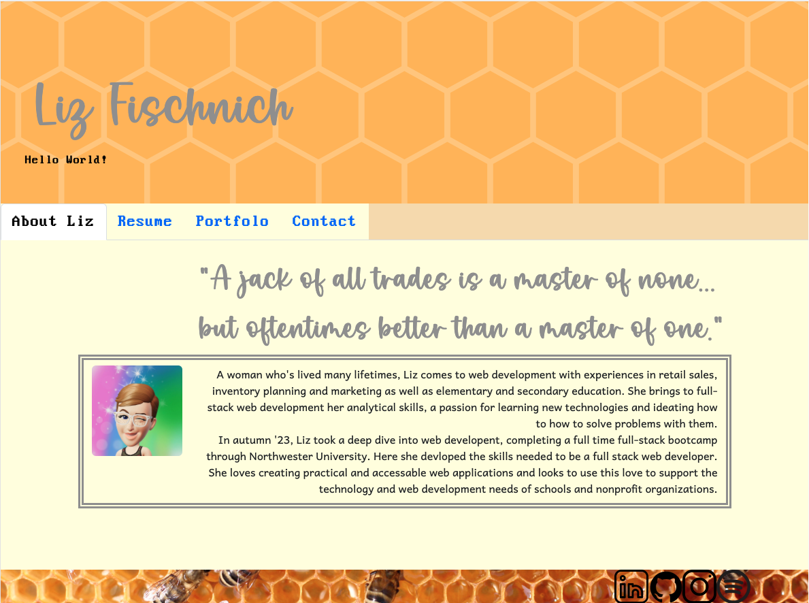
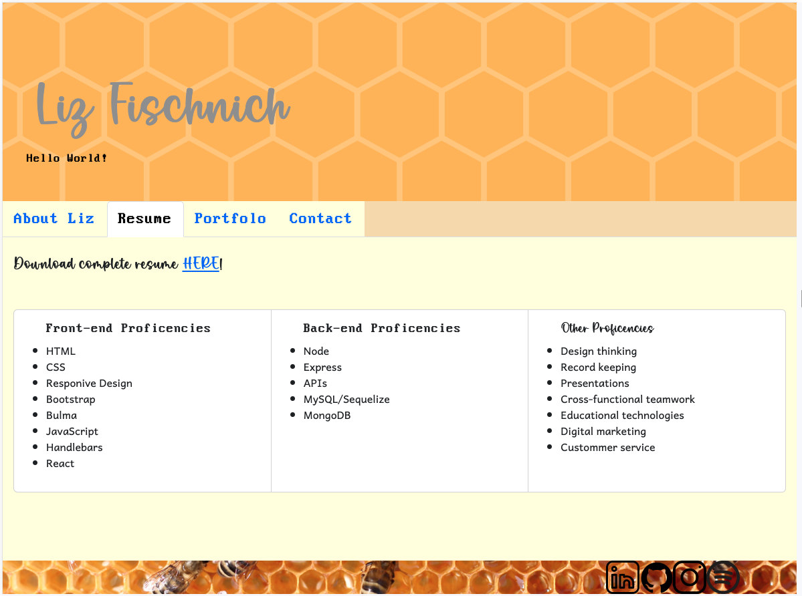
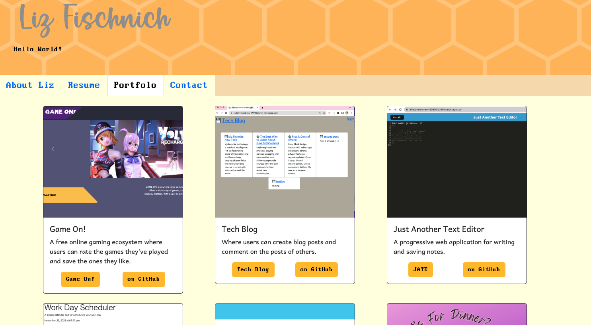
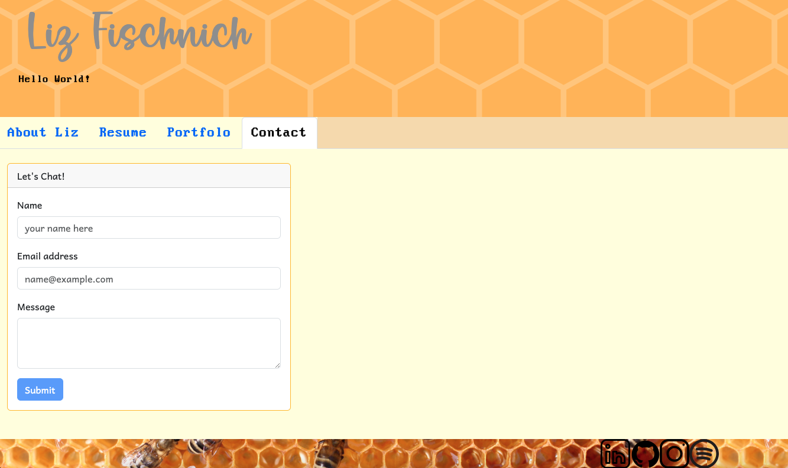

# Liz Makes a Portfolio Using React
  
  ## Description: 
  This project is a showcase of my work and resume using the React.js framework.I will continue to wrok on it to display future projects and update work experiences.
  ## Table of Contents: 
  * [installation](#installation)
  * [credits](#credits)
  * [License](#license)

  
  
  
  

  ## Installation: 
  The portfolio can be accessed [HERE](https://majestic-sunflower-4adc14.netlify.app).
  ## Credits: 
  Made by [Liz](https://github.com/lizfischstix) with support from her BFF ChatGPT.
  
  ## Contact:
  Get in touch on GitHub [@lizfischstix](https://github.com/lizfischstix)
  ## License:
    This project is licensed under the MIT license